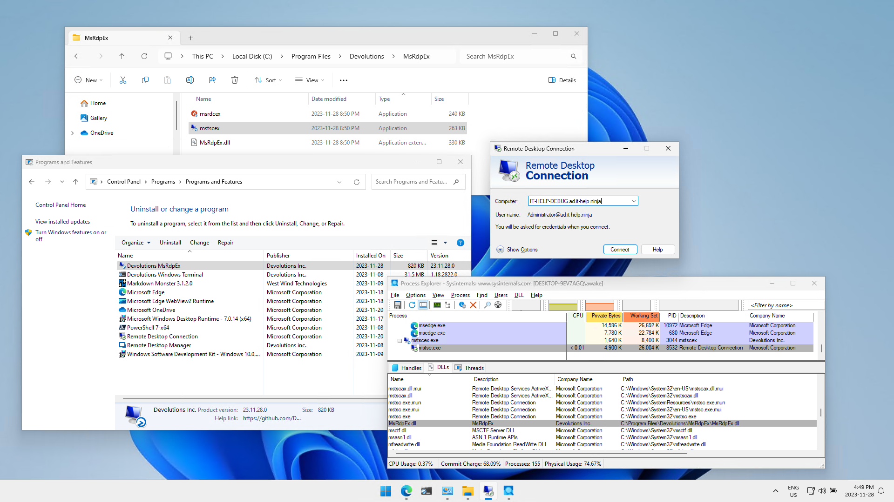

# Microsoft RDP Extensions (MsRdpEx)

## Installation

Download and install the latest MsRdpEx MSI package [GitHub releases](https://github.com/Devolutions/MsRdpEx/releases).

After installation, the launcher executables and API hooking DLL can be found in "%ProgramFiles%\Devolutions\MsRdpEx":



The installer automatically associates .RDP files with mstscex, and .RDPW files with msrdcex, so you can get started right away. Simply revert the file type association to use the original Microsoft Remote Desktop Clients without the extensions, or launch mstsc.exe/msrdc.exe manually.

This repository also contains a C# [nuget package](https://www.nuget.org/packages/Devolutions.MsRdpEx) that can be used to consume the RDP ActiveX interface with or without API hooking, along with launching mstsc.exe or msrdc.exe as external processes using MsRdpEx.dll.

## Extended .RDP File Options

MsRdpEx processes additional .RDP file options that are not normally supported by mstsc.exe:

| RDP setting                        | Description            | Values                 | Default value          |
|------------------------------------|------------------------|------------------------|:----------------------:|
| KDCProxyURL:s:value | Kerberos KDC Proxy HTTPS URL | KDC Proxy HTTPS *URL*, not using error-prone KDCProxyName format, and unrestricted in length, like https://<hostname>:443/KdcProxy | - |
| UserSpecifiedServerName:s:value | Server name used for TLS and Kerberos server validation | explicit server name (usually the machine FQDN) | same as DNS hostname used for RDP server |
| EnableMouseJiggler:i:value | Enable RDP mouse jiggler | 0/1 | 0 |
| MouseJigglerInterval:i:value | RDP mouse jiggler interval in seconds | Interval in seconds | 60 |
| MouseJigglerMethod:i:value | RDP mouse jiggler method | 0/1 | 0 |
| AllowBackgroundInput:i:value | Allow background input events when window is not in focus | 0/1 | 0 |
| EnableRelativeMouse:i:value | Enable relative mouse mode | 0/1 | 0 |
| DisableCredentialsDelegation:i:value | Disable CredSSP credential delegation | 0/1 | 0 |
| RedirectedAuthentication:i:value | Enable Remote Credential Guard | 0/1 | 0 |
| RestrictedLogon:i:value | Enable Restricted Admin Mode | 0/1 | 0 |
| DisableUDPTransport:i:value | Disable RDP UDP transport (TCP only) | 0/1 | 0 |
| ConnectToChildSession:i:value | Connect to child session | 0/1 | 0 |
| EnableHardwareMode:i:value | Disable DirectX client presenter (force GDI client presenter) | 0/1 | 1 |
| ClearTextPassword:s:value | Target RDP server password - use for testing only | Insecure password | - |
| GatewayPassword:s:value | RD Gateway server password - use for testing only | Insecure password | - |

## Extended RDP client logs

MsRdpEx also supports extended logging controlled by environment variables:

```powershell
$Env:MSRDPEX_LOG_ENABLED="1"
$Env:MSRDPEX_LOG_LEVEL="DEBUG"
.\mstscex.exe <destination.rdp>
```

If you don't pass a .RDP file, the mstsc.exe GUI will launch normally, but you won't be able to leverage any of the extended MsRdpEx .RDP file options. The default log file path location is in "%LocalAppData%\MsRdpEx\MsRdpEx.log". You can override log settings using the MSRDPEX_LOG_LEVEL and MSRDPEX_LOG_FILE_PATH environment variables:

```powershell
$Env:MSRDPEX_LOG_ENABLED="1"
$Env:MSRDPEX_LOG_LEVEL="TRACE"
$Env:MSRDPEX_LOG_FILE_PATH="C:\Windows\Temp\MsRdpEx.log"
.\mstscex.exe
```

The trace log level is extremely verbose, so it should only be used when necessary. The MsRdpEx logging is very helpful in understanding the Microsoft RDP client internals.

## Building from source

Generate the Visual Studio project files for your target platform:

```powershell
mkdir build-x64 && cd build-x64
cmake -G "Visual Studio 18 2026" -A x64 ..
```

Open the Visual Studio solution or build it from the command-line:

```powershell
cmake --build . --config Release
```

You should now have mstscex.exe and MsRdpEx.dll.
