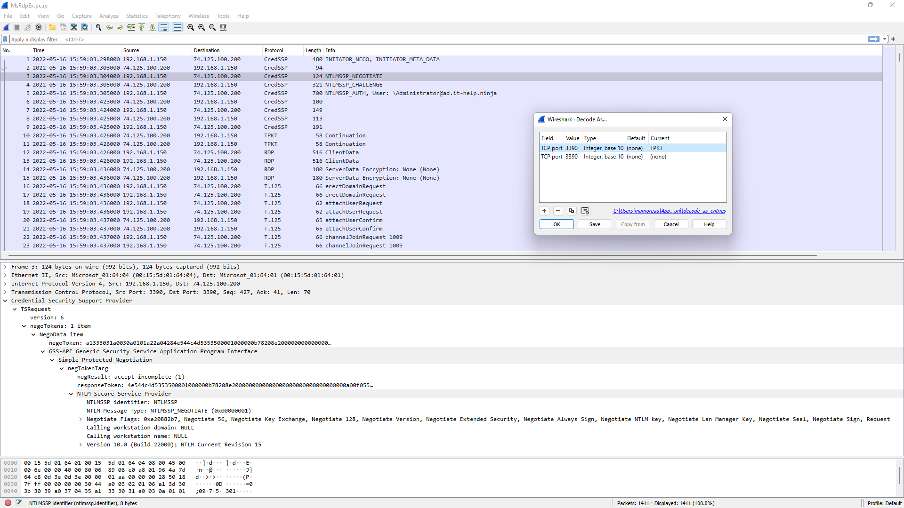

# Microsoft RDP Extensions (MsRdpEx)

## Building from source

Using a [Visual Studio developer shell](https://www.powershellgallery.com/packages/VsDevShell), build the [Detours](https://github.com/Microsoft/Detours) library:

```powershell
Enter-VsDevShell x64
.\detours.ps1
```

Generate the Visual Studio project files for your target platform:

```powershell
mkdir build-x64 && cd build-x64
cmake -G "Visual Studio 17 2022" -A x64 ..
```

Open the Visual Studio solution or build it from the command-line:

```powershell
cmake --build . --config Release
```

You should now have MsRdpEx.exe and MsRdpEx.dll.

## Launching MsRdpEx

MsRdpEx.exe can launches mstsc.exe with MsRdpEx.dll injected, enabling the MsRdpEx extensions. The goal is to easily launch mstsc.exe with or without the API hooking, which is why no other generic DLL injection technique is used. As far as AVs are concerned, this should not trigger any alarms.

This repository also contains a C# nuget package that can be used to consume the RDP ActiveX interface with or without API hooking, along with launching mstsc.exe or msrdc.exe as external processes using MsRdpEx.dll.

The simplest way to get started is to launch MsRdpEx.exe with a .RDP file. Make sure that MsRdpEx.dll is in the same directory as MsRdpEx.exe:

```powershell
$Env:MSRDPEX_LOG_LEVEL="DEBUG"
.\MsRdpEx.exe <destination.rdp>
```

If you don't pass a .RDP file, the mstsc.exe GUI will launch normally, but you won't be able to leverage any of the extended MsRdpEx .RDP file options. The default log file path location is in "%LocalAppData%\MsRdpEx\MsRdpEx.log". You can override log settings using the MSRDPEX_LOG_LEVEL and MSRDPEX_LOG_FILE_PATH environment variables:

```powershell
$Env:MSRDPEX_LOG_LEVEL="TRACE"
$Env:MSRDPEX_LOG_FILE_PATH="C:\Windows\Temp\MsRdpEx.log"
.\MsRdpEx.exe
```

The trace log level is extremely verbose, so it should only be used when necessary. The MsRdpEx logging is very helpful in understanding the Microsoft RDP client internals.

## Extended .RDP File Options

MsRdpEx processes additional .RDP file options that are not normally supported by mstsc.exe: 

| RDP setting                        | Description            | Values                 | Default value          |
|------------------------------------|------------------------|------------------------|:----------------------:|
| DisableCredentialsDelegation:i:value | Disable CredSSP credential delegation | 0/1 | 0 |
| RedirectedAuthentication:i:value | Enable Remote Credential Guard | 0/1 | 0 |
| RestrictedLogon:i:value | Enable Restricted Admin Mode | 0/1 | 0 |
| UserSpecifiedServerName:s:value | Server name used for TLS and Kerberos server validation | explicit server name (usually the machine FQDN) | same as DNS hostname used for RDP server |
| DisableUDPTransport:i:value | Disable RDP UDP transport (TCP only) | 0/1 | 0 | 
| EnableHardwareMode:i:value | Disable DirectX client presenter (force GDI client presenter) | 0/1 | 1 |
| ClearTextPassword:s:value | Target RDP server password - use for testing only | Insecure password | - |
| GatewayPassword:s:value | RD Gateway server password - use for testing only | Insecure password | - |

## Wireshark Packet Capture

Inspecting RDP traffic can be tricky, especially if you cannot modify the RDP server to install a test certificate + weaken SChannel cipher suites to prevent perfect forward secrecy. MsRdpEx can hook the SSPI API calls made by mstsc.exe to capture the decrypted packets and dump them into a reconstructed pcap file. The resulting packet capture looks like RDP traffic sent directly over TCP, without TLS, making it easier to inspect in Wireshark. To use this feature, enable logging and pcap file dumping through environment variables before launching MsRdpEx.exe:

```powershell
$Env:MSRDPEX_LOG_LEVEL="DEBUG"
$Env:MSRDPEX_PCAP_DUMP="1"
$Env:MSRDPEX_PCAP_FILE_PATH="C:\Windows\Temp\MsRdpEx.pcap"
.\MsRdpEx.exe
```

To obtain a clean packet capture, make a single RDP connection and then close mstsc.exe. The X.224 connection request/confirm PDUs are not yet supported, since only buffers going through the SChannel APIs are dumped. Depending on the protocol features used, it is possible that unrelated buffers get captured, so mileage may vary. If Wireshark has trouble dissecting messages, try taking shorter captures with minimal graphical updates. The reconstructed capture always uses port 3390 and fake IP addresses for the RDP client and server to avoid a problem where Wireshark expects TLS traffic over port 3389. To enable the RDP dissector, right-click on any packet, select "Decode As.." and make sure that TCP port 3390 is set to use the TPKT dissector:


